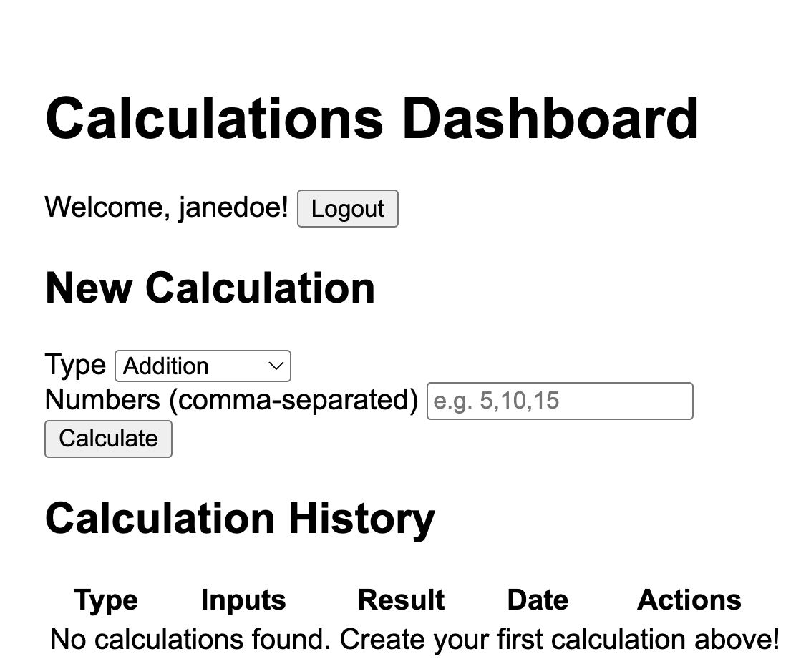
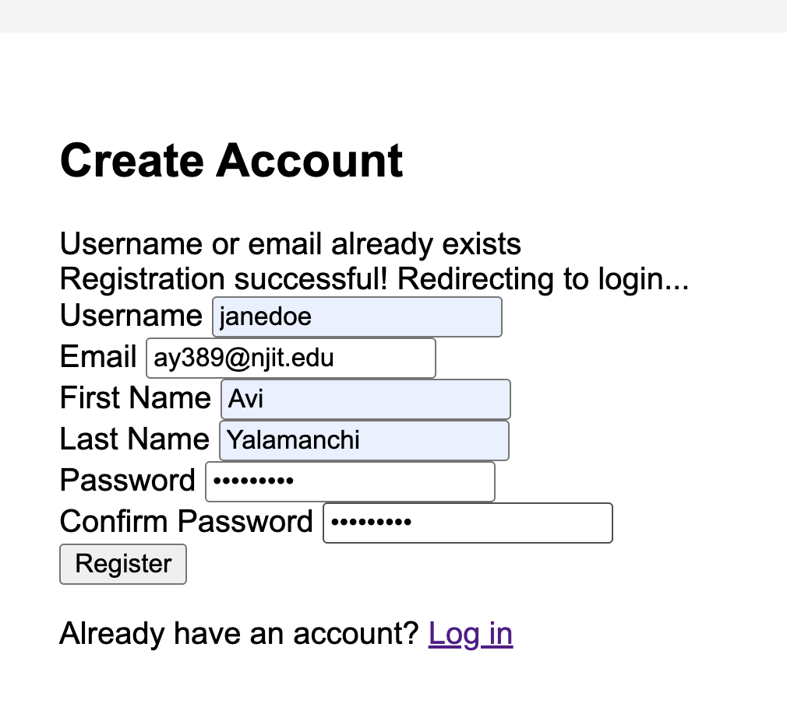

Avi Yalamanchi
ISO601
Assignment #13

Github Link: https://github.com/ay389-NJIT/assignment13

DockerHub Link: https://hub.docker.com/repository/docker/aviyalamnjit/601_module13/general

Reflection: [text](<misc_docs/Module#13 Reflection.pdf>)

GitHub Actions Successful: 

Playwright E2E Tests:
.png>)
.png>)

Front-End Login: 
Front-End Registration: 

